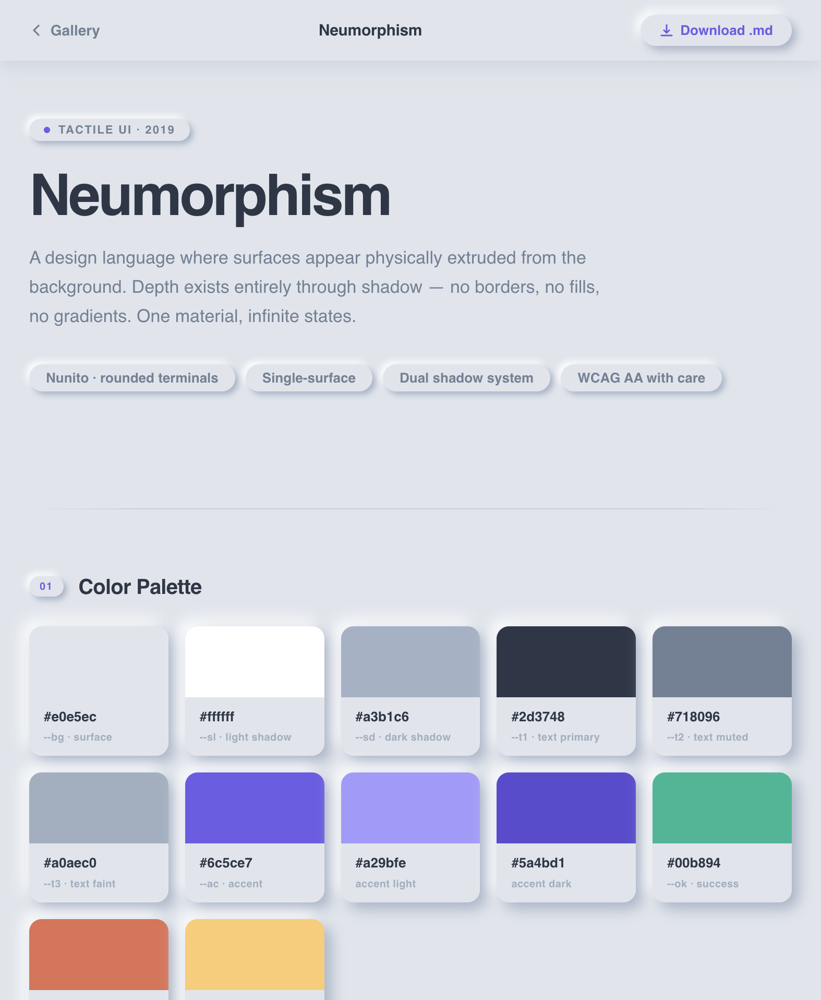

# Visual Vocabulary

A reference library of visual design systems for AI-generated UI.

37 distinct visual styles — each with an interactive demo and a downloadable Markdown spec. Built as a fast, browsable gallery so you can pick a visual direction (Bauhaus, Brutalist, Glassmorphism, TRON, Y2K, Cyberpunk, Swiss, etc.) and hand the spec to an LLM or designer.



## Styles included

Acid · AI Native · Apple Mac · Art Deco · Art Nouveau · Bauhaus · Bento Box · Brutalist · Claymorphism · Constructivism · Cyberpunk · Dark Academia · Dark Editorial · De Stijl · Dieter Rams · Engineer Mono · Frutiger Aero · Glassmorphism · Glitch · IBM Carbon · Kawaii · Liquid Glass · Material You · Memphis · Neubrutalism · Neumorphism · Organic · Pixel Art · Pop Art · Risograph · Skeuomorphic · Solar Punk · Swiss · Terminal · TRON · Vaporwave · Windows 95 · Y2K

## Structure

```
visual-vocabulary/
├── index.html              # Gallery — searchable, filterable
└── styles/
    └── <style-name>/
        ├── demo.html       # Interactive demo of the style
        └── style-guide.md  # Spec: palette, type, spacing, motion
```

## Run locally

It's a single static file with no build step.

```bash
open index.html
```

Or serve it:

```bash
python3 -m http.server 8000
# → http://localhost:8000
```

## How to use a style

1. Browse the gallery and pick a style.
2. Open its `style-guide.md` for hex palette, typography, spacing, and motion rules.
3. Paste the spec into your LLM prompt or hand it to a designer.

## License

MIT
